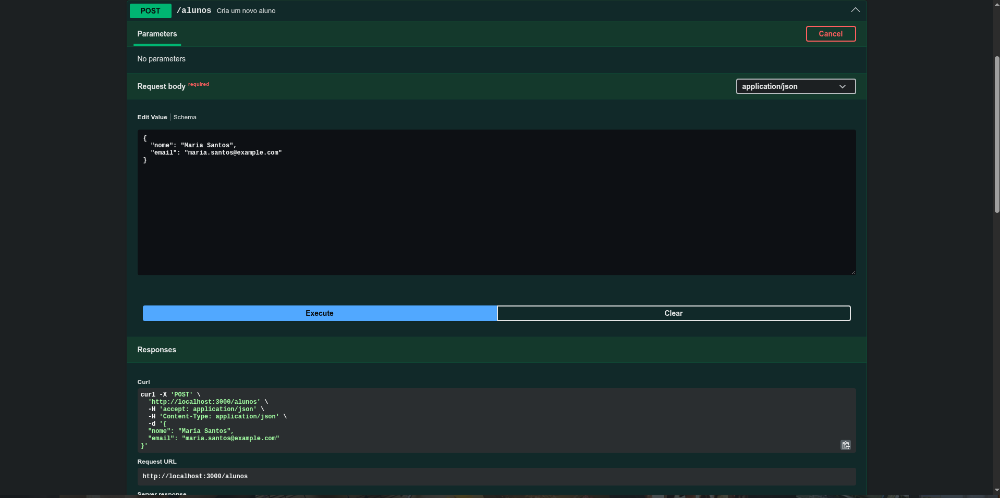
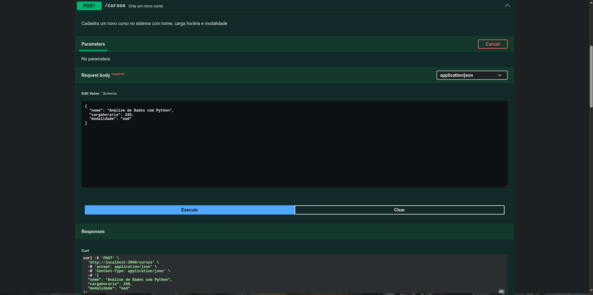
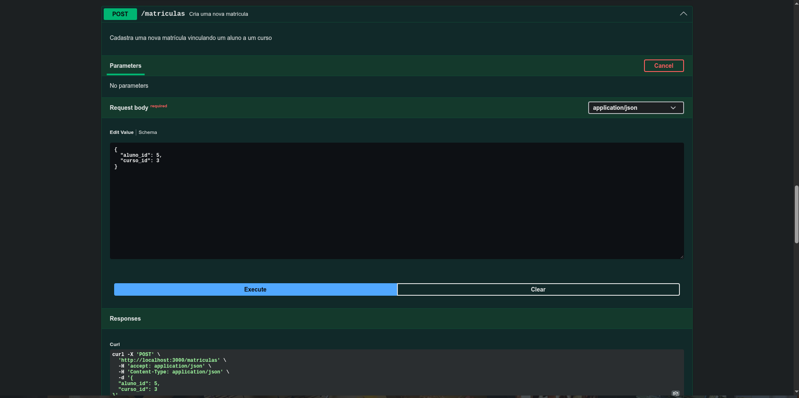
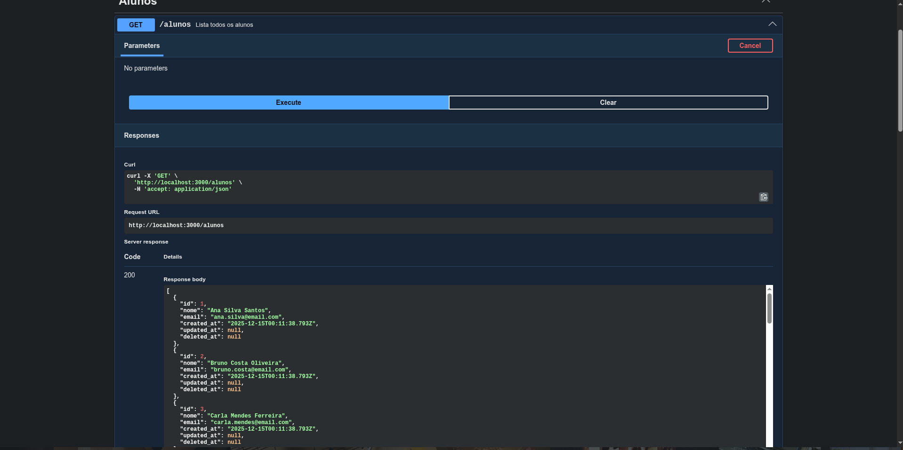
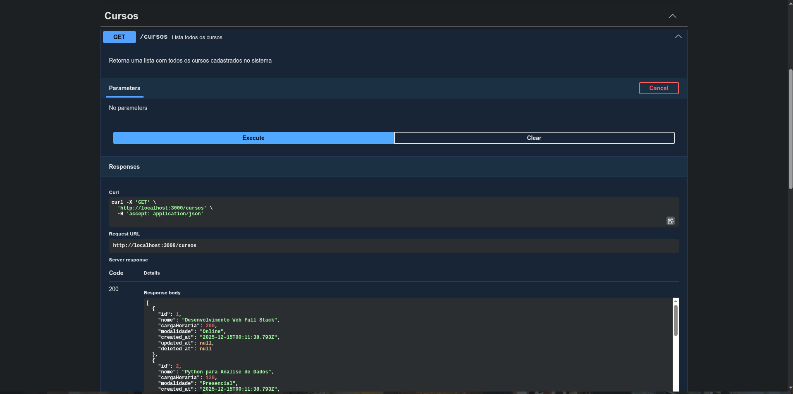
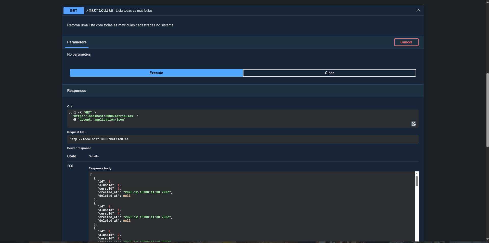

# API Alunos

## Descrição

API Escolar para gerenciamento de alunos, cursos e matrículas. O sistema foi desenvolvido com Node + Typescript, ExpressJS, Sequelize e base de dados em PostgreSQL. Ele funciona por CLI (Command Line Interface), mas pode ser testado/utilizado por Swagger UI que está integrado no projeto.
  
## Tecnologias

<div style="display: inline_block">
    <br>
    
    
    
    
</div>

## Como instalar?

1. É possível instalar por [arquivo .zip](https://github.com/Sansao77/api-alunos/archive/refs/heads/main.zip)
2. Ou, se tiver git instalado, utilize o seguinte comando no terminal:

  ```bash
  git clone https://github.com/Sansao77/api-alunos.git
  ```
  
## Como utilizar o projeto?

É possível utilizar o projeto de duas formas:

- Utilizando somente Docker e utilizando o docker-compose (mais simples)
- Utilizando NodeJS e um banco de dados PostgreSQL

A baixo vou explicar como utilizar ambos

### Instalação com Docker

1. É necessário ter Docker instalado em seu computador. Siga as instruções do site oficial: [https://docs.docker.com/get-docker/](https://docs.docker.com/get-docker/)
2. Depois de instalar teste se está instalado corretamento utilizando o terminal (Linux/MacOS) ou PowerShell:

  ```bash
  docker --version
  ```

3. Abra o terminal no diretório do projeto (dentro da pasta api-alunos) e rode o seguinte comando:

  ```bash
  docker compose up -d
  ``` 

4. Apos isso o projeto estará funcional e rodando! Pode visualizar e testar a API, pelo Swagger UI, na rota: [http://localhost:3000/api-docs](http://localhost:3000/api-docs)

5. (Opcional) Caso deseje parar o projeto, siga o comando abaixo da mesma forma no passo 3:

  ```bash
  docker compose stop 
  ```
  
6. (Opcional) Caso deseje remover o projeto, siga o comando abaixo da mesma forma no passo 3:

  ```bash
  docker compose down --volumes --remove-orphans
  ```
  
### Instalação com NodeJS e PostgreSQL

1. É necessário para rodar dessa forma

  - NodeJS ([https://nodejs.org/pt/download](https://nodejs.org/pt/download)) [O projeto foi criado na versão 24.12]
  - PostgreSQL ([https://www.postgresql.org/download/](https://www.postgresql.org/download/)) [O projeto foi criado na versão 15]

2. (Opcional) É possível instalar um banco de dados PostgreSQL com Docker, caso instale utilize o comando a baixo para rodar:

  ```bash
  docker run --name escola \
  -e POSTGRES_USER=escola \
  -e POSTGRES_PASSWORD=escola \
  -p 5432:5432 \
  -d postgres:15
  ```

3. Após configurar o banco de dados PostgreSQL, crie um schema de dados chamado escola (banco padrão) ou pode criar o schema com o nome e senha que achar adequado. É necessário configurar os dados definidos no banco, para o projeto criando um arquivo, .env (o arquivo .example.env é um exemplo para o .env) no qual você defini as variáveis de ambiente do projeto e configura como achar melhor.

4. Entre dentro da pasta do projeto e rode o seguinte comando:

  ```bash
  npm i && node ./src/server.ts
  ```

5. Após isso o projeto estará funcional e rodando! Pode visualizar e testar a API, pelo Swagger UI, na rota: [http://localhost:3000/api-docs](http://localhost:3000/api-docs)

## Exemplos da API com Swagger UI

1. Criar aluno

  

2. Criar curso

  

3. Criar matrícula

  

4. Consultar alunos listados

  

5. Consultar cursos listados

  

6. Consultar matrículas listadas

  
